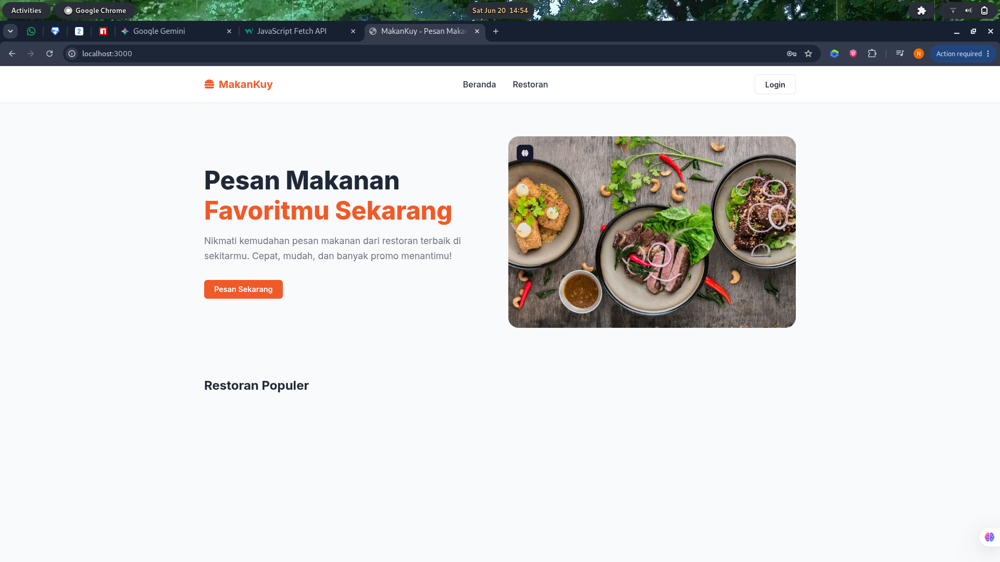
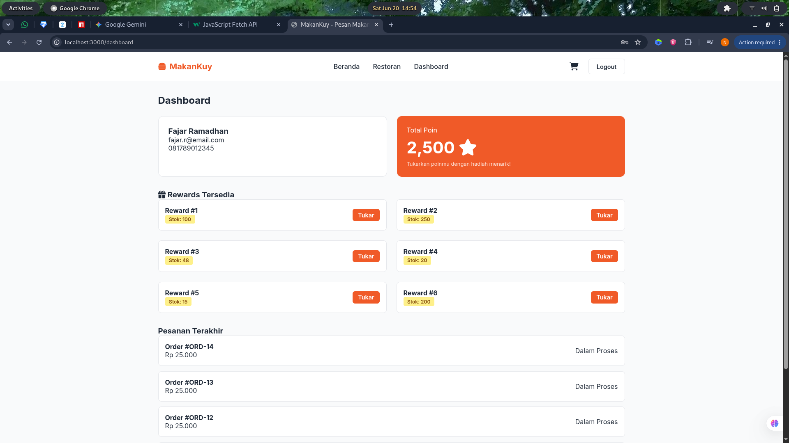
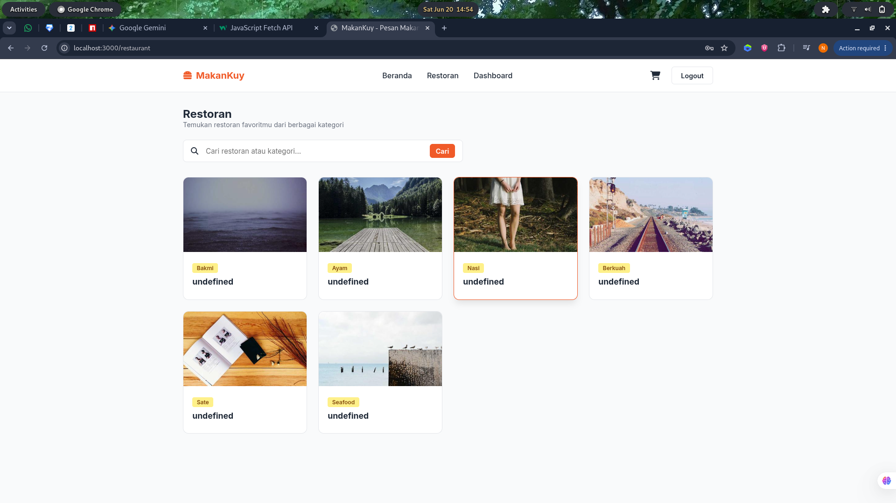
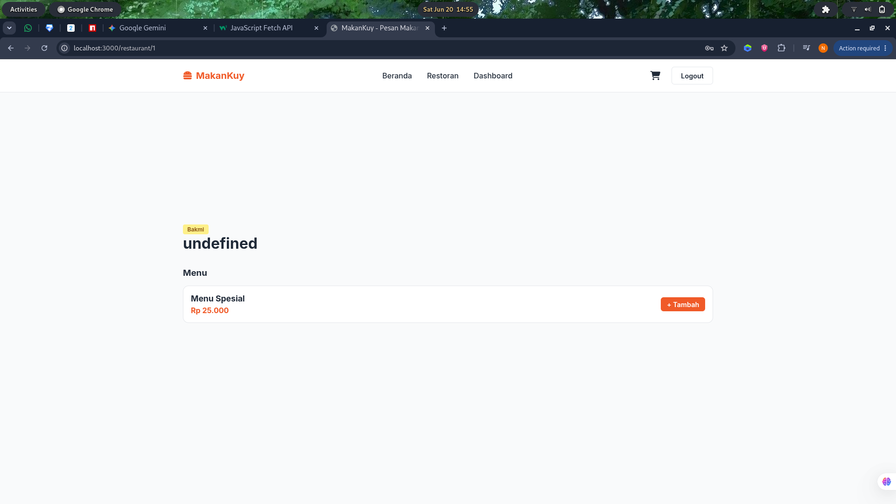
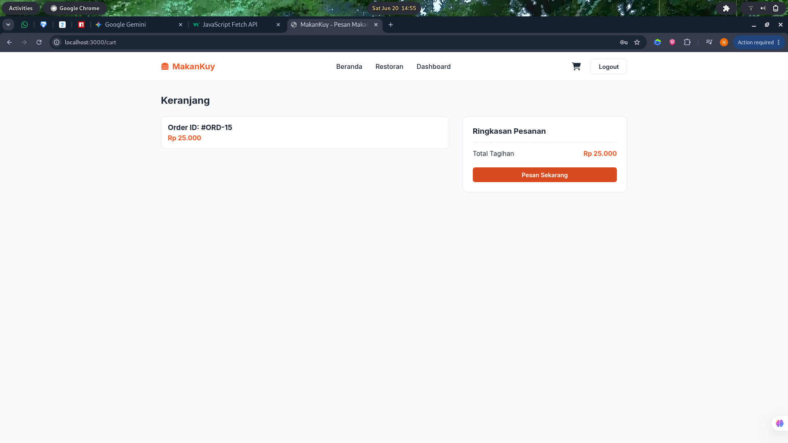

# 🚀 Web Application Project

Deskripsi singkat yang menarik tentang aplikasi Anda. Misalnya: *Aplikasi berbasis web untuk mengelola data secara real-time, dirancang dengan antarmuka yang bersih dan arsitektur backend yang kokoh.*

---

## 🛠️ Tech Stack

Aplikasi ini dibangun menggunakan kombinasi teknologi berikut untuk memastikan performa yang optimal dan kemudahan pengembangan:

| Bagian | Teknologi | Deskripsi |
| :--- | :--- | :--- |
| **Frontend** | `HTML5` `CSS3` `JavaScript (ES6+)` | Menyediakan antarmuka pengguna (UI) yang responsif, interaktif, dan murni tanpa framework tambahan. |
| **Backend** | `Node.js` `Express.js` | Menangani logika bisnis, manajemen *routing*, dan pembuatan RESTful API yang cepat. |
| **Database**| `MySQL` | Menyimpan data aplikasi secara relasional dengan struktur yang aman dan terorganisir. |

---

## 🔄 Alur & Arsitektur Aplikasi

Aplikasi ini menggunakan pendekatan **Client-Server Architecture** dengan alur kerja sebagai berikut:
1. **Client Side (Frontend):** Pengguna berinteraksi dengan halaman web. JavaScript menangkap *event* (seperti klik tombol atau pengiriman form) dan mengirimkan *request* data secara asinkronus menggunakan `fetch()` ke server backend.
2. **Server Side (Backend):** Express.js menerima *request* pada *endpoint* tertentu, melakukan validasi, lalu mengeksekusi logika bisnis lewat controller.
3. **Database Layer:** Backend berkomunikasi dengan MySQL menggunakan query SQL untuk mengambil, menambah, mengubah, atau menghapus data, lalu mengembalikan hasilnya ke Frontend dalam format JSON untuk di-render ke layar pengguna.

---

## 📸 Dokumentasi Tampilan & Fitur

Berikut adalah urutan fungsionalitas aplikasi berdasarkan tangkapan layar yang tersedia di dalam folder `/img`:

### 🗂️ Galeri Interface

| 1. Halaman Utama / Dashboard | 2. Form Input & Validasi | 3. Tabel & Detail Data |
| :---: | :---: | :---: |
|  |  |  |
| Menampilkan ringkasan informasi data secara keseluruhan saat pertama kali diakses. | Tempat pengguna memasukkan data baru dengan validasi input di sisi klien. | Menampilkan list data secara terstruktur dengan opsi aksi. |

| 4. Fitur Modifikasi (Edit/Update) | 5. Manajemen Status / Laporan |
| :---: | :---: |
|  |  |
| Antarmuka interaktif untuk mengubah data yang sudah ada di database. | Menampilkan status akhir pengerjaan atau ekspor laporan performa data. |

---

## ⚡ Fitur Utama Aplikasi

* **Operasi CRUD Lengkap:** Kemampuan penuh untuk *Create, Read, Update,* dan *Delete* data secara langsung ke database MySQL.
* **Asynchronous Data Loading:** Pembaruan tampilan web tanpa perlu memuat ulang seluruh halaman (*no-reload page*), memanfaatkan Fetch API.
* **Desain Responsif:** Layout yang fleksibel dan nyaman diakses baik melalui perangkat desktop maupun mobile.
* **RESTful API Design:** Struktur endpoint backend yang rapi, memudahkan jika ingin dikembangkan ke aplikasi mobile di masa depan.

---

## 📦 Langkah Instalasi

Ikuti langkah-langkah berikut untuk menjalankan proyek ini di lingkungan lokal Anda:

### 1. Prasyarat
Pastikan Anda sudah menginstal:
* [Node.js](https://nodejs.org/) (Versi LTS direkomendasikan)
* [MySQL Server](https://www.mysql.com/) (atau XAMPP/Laragon)

### 2. Kloning Repositori
```bash
git clone [https://github.com/username/nama-repo.git](https://github.com/username/nama-repo.git)
cd nama-repo